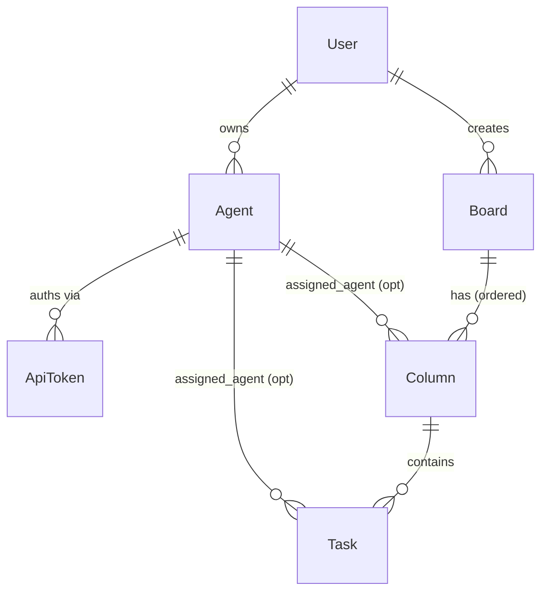
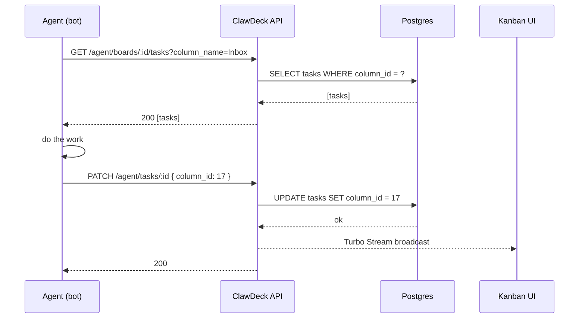

# 🦞 ClawDeck (HeitorTomaz fork)

[](https://www.ruby-lang.org/)
[](https://rubyonrails.org/)
[](https://www.postgresql.org/)
[](LICENSE)
[]()

**Open-source mission control for your AI agents — a kanban board where humans and bots share the same lanes.**

ClawDeck is a Rails app that lets you organize work for AI agents (built on [OpenClaw](https://github.com/openclaw/openclaw) or anything else that can hit a REST API) the same way you'd manage a team on Trello or Linear. Boards hold columns, columns hold tasks, agents pull work, you watch progress stream in.

This fork adds **per-board editable columns**, a first-class **Agent model** decoupled from `User`, and a **hashed agent token** for at-rest safety.

---

## 🤔 Why this fork?

The original [clawdeckio/clawdeck](https://github.com/clawdeckio/clawdeck) shut down its hosted service on **May 30, 2026**. The upstream repo still exists but the maintainers' focus moved to [lst.so](https://lst.so).

This fork keeps the self-hostable core alive for people who liked the simple kanban-for-agents idea and want to:

- Run their own instance without depending on a hosted product.
- Carry security patches (token hashing) that hadn't landed upstream.
- Extend the data model for richer pipelines (dynamic columns, multiple agents per user).

**There is no plan to PR back upstream** — the fork is maintained as a parallel project for as long as it's useful. **External PRs here are very welcome**, though. Open an issue first if it's a big change.

---

## 🔀 What's different vs upstream

| Area | Upstream | This fork |
|---|---|---|
| Agent token at rest | Plaintext `token` column | **SHA-256 `token_digest`** (raw token shown once on create) |
| Columns per board | Fixed enum: `inbox / up_next / in_progress / in_review / done` | **Dynamic `Column` model**, add/rename/reorder/delete per board |
| Agent identity | Implicit (1 agent per `User`, via `assigned_to_agent` bool) | First-class **`Agent` model**: `User has_many :agents`; tokens belong to an Agent |
| Column ownership | n/a | Column may optionally have an **`assigned_agent`** (acts as that agent's queue) |
| API filter | `?status=in_progress` | `?column_id=42` or `?column_name="In Review"` *(breaking change)* |

> Status of changes: token hashing is **shipped**. The Agent + Column refactor is **in development** on `agent-columns`, executed in parallel by 3 sub-agents (models / controllers / views).

---

## 🧠 How it works

### Core concepts

- **User** — the human who logs in (Clerk or `LOCAL_AUTH_TOKEN`).
- **Agent** — a named AI identity owned by a User. Holds API tokens. A User can have many.
- **ApiToken** — bearer credential (`X-Agent-Token`) that authenticates *as an Agent*. Stored hashed.
- **Board** — a kanban surface. Has many Columns.
- **Column** — a stage on the board. Editable per-board; optionally pinned to a specific Agent.
- **Task** — a card. Lives in exactly one Column; may have an `assigned_agent`.

### Domain model



### Agent polling loop



---

## 🚀 Quick start (local Docker)

### Prerequisites
- [Docker Desktop](https://www.docker.com/products/docker-desktop/) (Compose v2)

### Run it

```bash
git clone https://github.com/HeitorTomaz/clawdeck.git
cd clawdeck
cp .env.example .env   # then edit — see vars below
docker compose -f compose.local.yml up -d
```

Open <http://localhost:3001> and paste your `LOCAL_AUTH_TOKEN` to sign in as the admin user.

### Required env vars

| Var | Notes |
|---|---|
| `LOCAL_AUTH_TOKEN` | Bearer token for the local admin user. **≥50 chars**, random. |
| `POSTGRES_PASSWORD` | Password for the Postgres container. |
| `SECRET_KEY_BASE` | Rails secret. Generate with `bin/rails secret`. |
| `CLERK_*` *(optional)* | Set if you want Clerk-based auth instead of `LOCAL_AUTH_TOKEN`. |

### Useful commands

```bash
# Tail logs
docker compose -f compose.local.yml logs -f web

# Rails console
docker compose -f compose.local.yml exec web bin/rails console

# Run migrations
docker compose -f compose.local.yml exec web bin/rails db:migrate

# Stop
docker compose -f compose.local.yml down
```

---

## 🔐 Auth model

ClawDeck has **two distinct auth surfaces**:

### User auth (browser / dashboard)
- **Local dev:** `Authorization: Bearer <LOCAL_AUTH_TOKEN>` on the first hit, then session cookie.
- **Production:** [Clerk](https://clerk.com) (set `CLERK_PUBLISHABLE_KEY` + `CLERK_SECRET_KEY`).

### Agent auth (REST API for bots)
- Header: `X-Agent-Token: <raw-token>`
- Server hashes the incoming token (SHA-256) and looks it up in `api_tokens.token_digest`.
- Resolves to an **`Agent`** (not a User). `agent.user` gives you the owner.

### Getting an agent token

1. Sign in to the dashboard.
2. Go to **Profile → Agents**.
3. Create an Agent (give it a name, e.g. `"scraper-bot"`).
4. Click **Create token** — the raw token is shown **once**. Copy it now; only the hash is stored.
5. Export it where your bot runs: `export CLAWDECK_TOKEN=...`

---

## 📡 API quick reference (agent endpoints)

Base URL: `http://localhost:3001/api/v1/agent`

All requests require `X-Agent-Token: <token>`.

```bash
# List columns on a board
curl -H "X-Agent-Token: $CLAWDECK_TOKEN" \
  http://localhost:3001/api/v1/agent/boards/1/columns

# List tasks in a specific column (by name)
curl -H "X-Agent-Token: $CLAWDECK_TOKEN" \
  "http://localhost:3001/api/v1/agent/boards/1/tasks?column_name=Inbox"

# Create a task
curl -X POST -H "X-Agent-Token: $CLAWDECK_TOKEN" \
  -H "Content-Type: application/json" \
  -d '{"name":"Research topic X","column_id":12}' \
  http://localhost:3001/api/v1/agent/boards/1/tasks

# Move a task to a new column
curl -X PATCH -H "X-Agent-Token: $CLAWDECK_TOKEN" \
  -H "Content-Type: application/json" \
  -d '{"column_name":"In Review","activity_note":"Done, ready for review"}' \
  http://localhost:3001/api/v1/agent/tasks/42

# Heartbeat (mark the agent alive)
curl -X POST -H "X-Agent-Token: $CLAWDECK_TOKEN" \
  http://localhost:3001/api/v1/agent/heartbeat
```

> Breaking change vs upstream: `?status=X` is gone. Use `?column_id=` or `?column_name=`.

---

## 🤝 Contributing

PRs and issues are welcome on this fork.

### Dev setup (without Docker)

```bash
bundle install
bin/setup
bin/dev   # runs Rails + Tailwind + Solid Queue
```

### Tests & lint

```bash
bin/rails test           # minitest, models + controllers
bin/rails test:system    # Capybara system tests
bin/rubocop              # style
bin/brakeman             # security scan
bundle exec bundler-audit check --update
```

CI runs all of the above on every PR.

### Branch model
- `main` — fork's stable line.
- `agent-columns` — current dev branch for the Agent + Column refactor.
- Feature branches: `feat/<short-name>`, opened against the active dev branch.

---

## 📜 License

MIT — same as upstream. See [LICENSE](LICENSE).

## 🙏 Credits

Originally built by [mx.works](https://mx.works) and the OpenClaw community as [clawdeckio/clawdeck](https://github.com/clawdeckio/clawdeck). Huge thanks for open-sourcing it — this fork wouldn't exist without that work.

If you're looking for the maintainers' new project, check out [lst.so](https://lst.so).
